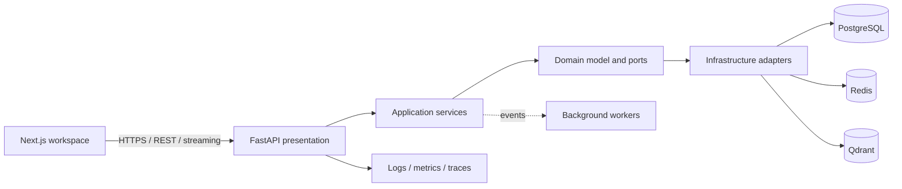

# Architecture

Each bounded context owns its domain, application use cases, ports, adapters, and HTTP routers. Dependencies point inward: presentation and infrastructure depend on application/domain contracts, never the reverse. CQRS is used for read-optimized repository/search views while commands retain transactional consistency. Domain events cross context boundaries through an outbox-backed event publisher.

Milestone 1 deliberately establishes the cross-cutting boundary rather than exposing unfinished domain APIs. `/health` and `/metrics` are operational APIs with complete tests and stable contracts.

## Design decisions and technology fit

FastAPI and Pydantic provide async I/O, strict contracts, and generated OpenAPI. Next.js provides a secure server-rendered React boundary; Tailwind plus shadcn-compatible components give an accessible, consistent UI system, while Monaco is reserved for the repository workspace slice. PostgreSQL is the source of truth, Redis supports caching and rate controls, and Qdrant serves vector retrieval. LangGraph, LiteLLM, MCP, and Tree-sitter enter only with the agent and repository-indexing slices, where their contracts can be tested end to end.

Configuration is injected at the composition root and adapters are selected there. This keeps infrastructure replaceable and makes use cases inexpensive to test. Health detail visibility is an environment-backed typed feature flag; the first migration creates the controlled-override table needed for audited rollouts.

## Delivery roadmap

1. **Foundation (complete):** monorepo, quality gates, observability, service probes, deployment topology.
2. **Identity and tenancy (complete):** users, organizations, JWT/refresh rotation, RBAC domain model, audit events, and Redis rate limiting.
3. **Repository intelligence:** Git provider adapters, safe checkout workers, Tree-sitter indexing, Qdrant search.
4. **Agent workspace:** persisted sessions, LiteLLM gateway, streaming chat, grounded retrieval, prompt-injection controls.
5. **Engineering execution:** planner graph, scoped tools, sandboxed terminal, edits, tests, and Git change sets.
6. **Collaboration and release:** PR generation, repository/agent memory, policy controls, tracing, load/security testing, production rollout.

## Risk analysis

| Risk | Control |
| --- | --- |
| Arbitrary code execution | Ephemeral sandbox, allowlisted tools, tenant-scoped filesystem, resource/time limits, no host Docker socket. |
| Prompt injection or data exfiltration | Treat repository text as untrusted, tool policy enforcement outside the model, provenance-tagged context, secret redaction. |
| Cross-tenant access | Organization-scoped queries, authorization in application services, audit logs, integration tests for every boundary. |
| Model latency/cost | Streaming, bounded context assembly, Redis caching, asynchronous indexing, provider budgets and fallbacks. |
| Retrieval correctness | Tree-sitter chunk boundaries, versioned embeddings, source citations, evaluation corpus and regression thresholds. |
| Operational failure | Readiness probes, structured logs, Prometheus metrics, traces, migrations, backups, and progressive feature flags. |

## Security posture

The API accepts only explicit CORS origins, emits security headers, validates all settings and request data, correlates requests without logging secrets, and provides no filesystem or terminal capability at this stage. Later terminal and repository adapters run behind per-tenant authorization and sandbox boundaries. Authentication uses short-lived signed access tokens plus rotated refresh-token records; no token implementation is introduced before its persistence and revocation semantics can be fully tested.
